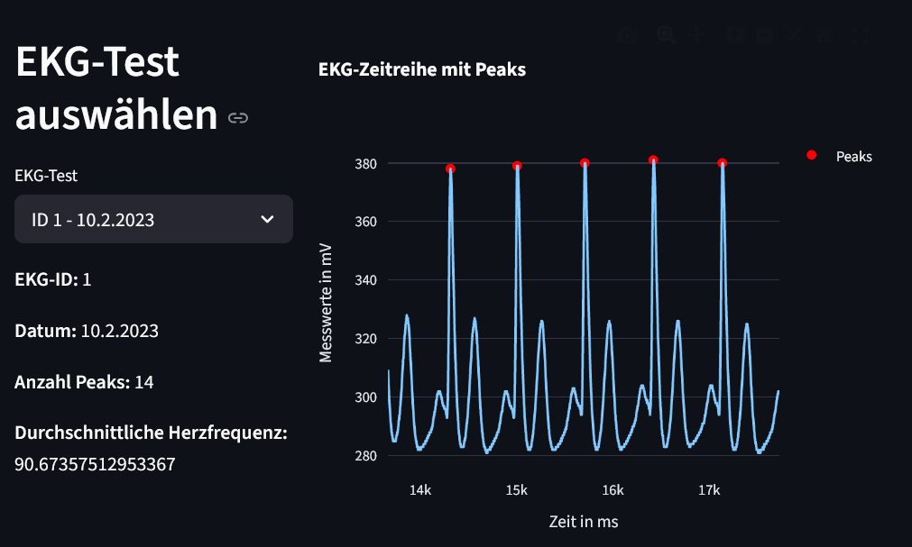

# Objektorientierung – EKG-App

Dieses Projekt ist die Abgabe zur Aufgabe **„Objektorientierung“** aus der Programmierübung II.

Die App ist mit `Streamlit` umgesetzt und verwendet die Klassen `Person` und `EKGdata`. Über ein Dropdown-Menü kann eine Versuchsperson ausgewählt werden. Danach werden Personendaten, das Bild der Person und die zugehörigen EKG-Tests angezeigt. Für den ausgewählten EKG-Test werden die EKG-Daten geplottet, Peaks markiert und eine durchschnittliche Herzfrequenz berechnet.

## Funktionen

* Personendaten aus `data/person_db.json` laden
* Versuchsperson über Dropdown auswählen
* Name, Geburtsjahr, Alter, Geschlecht und maximale Herzfrequenz anzeigen
* Bild der ausgewählten Person anzeigen
* EKG-Test auswählen
* EKG-Zeitreihe mit markierten Peaks plotten
* durchschnittliche Herzfrequenz berechnen


## Installation

Repository klonen:

```bash
git clone https://github.com/MatzeGit3/programmieren_2_aufgabe_2-4.git
```

In den Projektordner wechseln:

```bash
cd programmieren_2_aufgabe_2-4
```

Abhängigkeiten installieren:

```bash
pdm install
```

## App starten

Die Streamlit-App wird mit folgendem Befehl gestartet:

```bash
pdm run streamlit run main.py
```

Alternativ, wenn die virtuelle Umgebung bereits aktiviert ist:

```bash
streamlit run main.py
```

Danach öffnet sich die App im Browser unter:

```text
http://localhost:8501
```

## Screenshot

Die Datei `EKG_APP_1.png` zeigt einen Screenshot der Streamlit-App.


Die Datei `EKG_APP_2.png` zeigt einen Screenshot der Streamlit-App.




## Abgabe

Der finale Commit soll folgende Nachricht haben:

```text
git commit -m "Abgabe: Objektorientierung"
```
