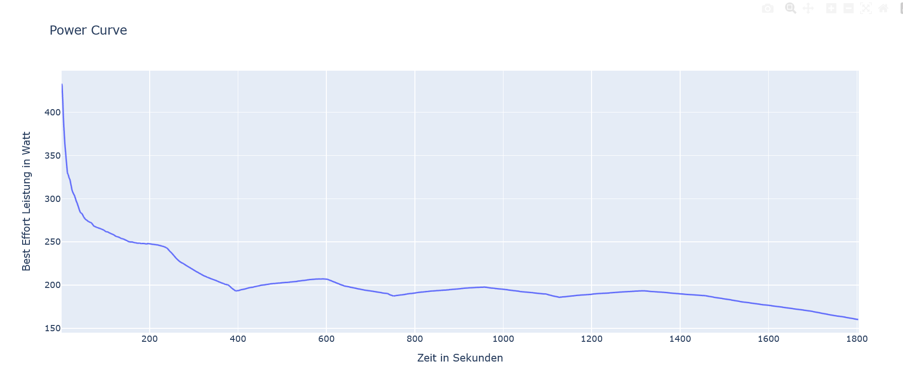

# Leistungskurve II

Dieses Projekt berechnet eine Power Curve aus Leistungsdaten eines Radfahrers. Dabei wird für verschiedene Zeitfenster die jeweils höchste durchschnittliche Leistung bestimmt und grafisch dargestellt.

## Funktionsweise

Die Leistungsdaten werden aus einer CSV-Datei eingelesen. Für jedes mögliche Zeitfenster wird mithilfe eines gleitenden Fensters (Rolling Window) die durchschnittliche Leistung berechnet. Anschließend wird die höchste gefundene Durchschnittsleistung gespeichert.

Die Ergebnisse werden in einem DataFrame gesammelt und anschließend als Power Curve visualisiert.

## Verwendete Bibliotheken

* pandas
* numpy
* plotly

## Projektstruktur

```text
.
├── data
│   └── activities
│       └── activity.csv
├── Power_Curve.py
├── README.md
└── screenshot.png
```

## Ausführung

Das Programm kann mit folgendem Befehl gestartet werden:

```bash
python Power_Curve.py
```

Nach dem Start werden:

1. die Leistungsdaten eingelesen,
2. die Power Curve berechnet,
3. die Ergebnisse im Terminal ausgegeben,
4. die grafische Darstellung im Browser geöffnet.

## Wichtige Funktionen

### `read_my_activities_csv()`

Liest die Aktivitätsdaten aus der CSV-Datei ein.

### `create_window_sizes()`

Erzeugt eine Liste aller möglichen Fenstergrößen für die Berechnung der Power Curve.

### `find_best_effort()`

Berechnet für eine Fenstergröße die maximale durchschnittliche Leistung.

### `create_PC_df()`

Erstellt einen DataFrame mit den berechneten Leistungswerten.

### `plot_power_curve()`

Visualisiert die Power Curve mit Plotly.

## Beispielausgabe

Die x-Achse zeigt die Dauer des Zeitfensters in Sekunden. Die y-Achse zeigt die maximale durchschnittliche Leistung in Watt, die innerhalb dieses Zeitfensters erreicht wurde.


## Screenshot

Die Datei `PC_screenshot.png` zeigt einen Screenshot der Streamlit-App.


